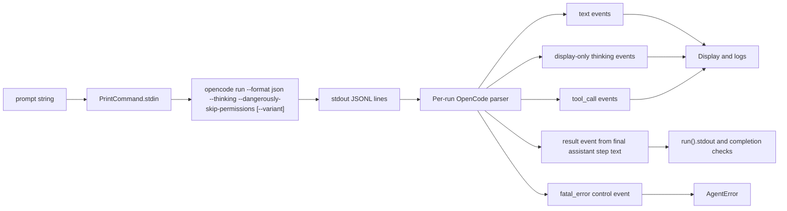

# Show OpenCode Output

## Easiest Approach

OpenCode supports JSONL output via `opencode run --format json`. Use that instead of redirecting stderr into stdout. Current OpenCode support in Sandcastle is raw stdout passthrough: every non-empty stdout line becomes a display `text` event, and `run().stdout` falls back to the raw process stdout because OpenCode emits no parsed `result`. Sandcastle already has the right provider/display pipeline in [`src/AgentProvider.ts`](src/AgentProvider.ts) and [`src/Orchestrator.ts`](src/Orchestrator.ts); the missing piece is a per-run OpenCode parser that maps OpenCode JSON events into Sandcastle's existing stream events, fatal diagnostics, and final-result semantics.

OpenCode 1.14.40 has been empirically checked with `--format json --thinking`: deeper prompts can emit visible `type: "reasoning"` events with `part.text`, while short prompts may only report token accounting in `step_finish.tokens`. Treat reasoning events as optional per run/model/prompt, and keep them display-only. Do not display `step_finish.tokens.reasoning` as thinking text. Total OpenCode token usage is tracked separately in Beads issue `sandcastle-162`.

Update the OpenCode provider print command to request structured output and visible reasoning events when OpenCode emits them. The prompt must be passed through `PrintCommand.stdin`, not argv:

```ts
const variantFlag = options?.variant
  ? ` --variant ${shellEscape(options.variant)}`
  : "";

return {
  command: `opencode run --format json --thinking --dangerously-skip-permissions --model ${shellEscape(model)}${variantFlag}`,
  stdin: prompt,
};
```

Do not include the prompt in the command string, and do not include a trailing `--` prompt separator when stdin is used. `--` only protects positional argv prompts; it is unnecessary when the prompt is not in argv. Tests should assert the prompt is present only in `stdin` and absent from the command string.

OpenCode print runs should always include `--dangerously-skip-permissions`. This is a deliberate non-interactive OpenCode behavior change for `opencode run`, not a new global Sandcastle permission policy. Leave OpenCode `buildInteractiveArgs()` unchanged for this flag because the installed CLI documents `--dangerously-skip-permissions` for `opencode run`, not clearly for the default TUI command.

Preserve PR #582's `OpenCodeOptions.variant?: string` support in this change. Keep `variant` as a free-form string because OpenCode variant values are provider-specific. Apply `--variant` only to print runs. `--variant` controls reasoning effort/model variant; `--thinking` controls whether visible reasoning events are emitted. They are orthogonal: high/max variants must not be assumed to produce visible thinking without `--thinking`, and `--thinking` must not be treated as a request for deeper reasoning.

`PrintCommand.stdin` support is required for OpenCode print runs. Most sandbox providers already pipe `exec(..., { stdin })`; unsupported providers must fail fast with a clear provider error instead of silently ignoring stdin and running OpenCode with an empty prompt. In the current codebase, the Vercel sandbox path should throw clearly when `opts.stdin` is provided until real stdin support is implemented. Do not add a Vercel-specific regression test in this pass.

Do not add an OpenCode version probe or runtime guard. If an installed OpenCode does not support `--format json`, `--thinking`, or stdin prompts, let stderr and the fail-closed JSON parser produce a clear failure.

Then parse the JSONL stream with state scoped to a single agent invocation:

- `text` with `part.text` -> `{ type: "text", text }` for display, append exact text to `currentAssistantStepText`, and append exact text to `assistantTextFallback`. Preserve assistant whitespace exactly in returned stdout.
- `reasoning` events with `part.text` -> display/log as text with `[thinking] ${text}` on its own line. Do not append reasoning to `currentAssistantStepText`, `assistantTextFallback`, `run().stdout`, completion checks, or plan extraction.
- `tool_use` with an allowlisted OpenCode tool -> `{ type: "tool_call", name, args }`, where `name` is the mapped Sandcastle display name. Normalize tool names to lowercase for lookup, then display PascalCase names.
- Allowlisted OpenCode tools for this pass: `bash` -> `Bash`, `websearch` -> `WebSearch`, `webfetch` -> `WebFetch`, `task` -> `Agent`, `read` -> `Read`, `glob` -> `Glob`, and `grep` -> `Grep`.
- For tool input, read `part.state.input` first and `part.input` second. Use only bounded per-tool display fields, then fall back to `part.state.title` if no known safe fields are present. Never include `part.state.output`, `part.state.metadata.output`, raw file contents, prompts, patches, old/new strings, or arbitrary JSON-stringified input objects.
- Tool display args should use bounded qualifiers: `Bash(command - description)`, `WebSearch(query)`, `WebFetch(url)`, `Agent(description, subagent_type)`, `Read(filePath lines offset-limit)`, `Glob(pattern in path/cwd)`, and `Grep(pattern in path include includeGlob)`. Normalize whitespace and cap the final args string at 200 characters with an ellipsis.
- `step_start` -> reset `currentAssistantStepText` and mark a new assistant step as active.
- `step_finish` with `part.reason === "tool-calls"` -> mark the current step as non-final and keep streaming state. If clean exit occurs after this without a later final assistant step, return empty structured stdout.
- `step_finish` with `part.reason === "stop"` -> `{ type: "result", result: currentAssistantStepText }`.
- `step_finish` with any other reason -> `{ type: "fatal_error", message }`. Unknown finish reasons control final-answer semantics and should fail clearly rather than guessing.
- `error` -> structured failure diagnostic, not assistant stdout. If OpenCode exits non-zero, use parsed error text as diagnostic fallback after stderr. If OpenCode exits 0, fail the run because an error event is not a successful assistant answer.
- Clean process exit with parsed JSON events but no final `step_finish` -> emit at most one result. If a later `step_start` has occurred, treat the latest step as authoritative even when empty. Otherwise prefer `currentAssistantStepText`, then the last non-empty assistant step, then `assistantTextFallback`, then `""`. Do not replay already-displayed text events during finalization.
- Any successful OpenCode JSON run that parsed at least one valid JSON event must mark the result as structured, even if the result text is empty or every event type is unknown. Sandcastle must not fall back to raw JSONL stdout for these runs.
- If OpenCode emits any non-empty malformed/non-JSON stdout line while the command requested `--format json`, fail closed with a fatal diagnostic. Ignore empty lines. Unknown-but-valid JSON event types are ignored for display/result but still count as structured output.
- For non-zero exits with structured OpenCode output, never expose raw JSONL stdout tails as fallback detail. Prefer stderr, then parsed structured diagnostics, then partial assistant text as diagnostic-only context, then a generic structured-output failure message.
- Error or fatal diagnostics override partial assistant text. Partial text may explain a non-zero failure, but it must not turn a failed stream into successful `stdout`.

Use PR #551's OpenCode JSON event fixtures as implementation reference for `text`, `tool_use`, `step_start`, and nested errors, but do not adopt its broad unknown-tool `JSON.stringify(input)` fallback or its choice to ignore `step_finish`.

Follow-up issues already exist for deliberately out-of-scope expansions:

- `sandcastle-l5l`: safely display OpenCode `write` and `edit` tool summaries.
- `sandcastle-df6`: investigate OpenCode session capture and resume.
- `sandcastle-162`: add OpenCode token usage summaries from JSON stream events.

## Small Interface Addition

Avoid storing OpenCode accumulator state directly on the `opencode(...)` provider object. A provider instance can be reused across iterations or concurrent runs, so provider-level mutable state can leak output between runs.

Add a small optional per-invocation stream parser hook to [`src/AgentProvider.ts`](src/AgentProvider.ts):

```ts
interface AgentStreamParser {
  parseStreamLine(line: string): ParsedStreamEvent[];
  finish?(options: { exitCode: number }): ParsedStreamEvent[];
}
```

Extend the exported `ParsedStreamEvent` union with a parser control event:

```ts
| { type: "fatal_error"; message: string }
```

`fatal_error` is not a display/log stream event and must not be forwarded to `onAgentStreamEvent`. It is a parser control event that makes the run fail cleanly.

`AgentProvider` keeps the existing `parseStreamLine(line)` method for current providers and custom providers. [`src/Orchestrator.ts`](src/Orchestrator.ts) should create one parser per `invokeAgent()` call and call `finish()` once after the process exits, before completion-signal detection. Process `finish()` events through the same helper used for streamed events, and emit at most one final OpenCode `result`.

```ts
const streamParser = provider.createStreamParser?.() ?? provider;
```

The OpenCode provider implements `createStreamParser()` and keeps `currentAssistantStepText`, `lastNonEmptyAssistantStepText`, `assistantTextFallback`, structured-output sentinels, non-final step state, and fatal diagnostics inside that parser object. Claude Code, Codex, and Pi can continue using their existing stateless `parseStreamLine()` behavior.

Because `AgentProvider` and `ParsedStreamEvent` are exported, export `AgentStreamParser` too. Keep `opencode().parseStreamLine()` compatible for direct callers by parsing individual JSON lines for display events only. Strict fail-closed malformed JSON behavior belongs only to the per-run parser from `createStreamParser()`, not to direct one-line parsing.

## Why This Is The Better Small Change

- Reuses the existing sandbox `onLine` contract, which currently streams stdout only.
- Reuses Sandcastle's existing `text`, `tool_call`, and `result` display/result events.
- Adds one parser control event for fatal stream failures instead of broad sandbox API changes.
- Keeps `run().stdout` focused on the final assistant answer instead of raw logs, stderr, tool output, prompt echoes, thinking, raw JSONL, or earlier assistant drafting.
- Preserves workflows like `plan.stdout.match(/<plan>([\s\S]*?)<\/plan>/)` and completion detection via `<promise>COMPLETE</promise>` much more like Claude Code does, where tags are intended to be final artifacts.
- Avoids ACP/Zed integration.
- Avoids provider-level mutable parser state, so reused provider instances do not cross-contaminate runs.

## Data Flow



## Implementation Steps

1. Update [`src/AgentProvider.ts`](src/AgentProvider.ts) so `opencode().buildPrintCommand()` includes `--format json --thinking --dangerously-skip-permissions`, preserves optional `OpenCodeOptions.variant` as print-run-only `--variant`, removes prompt argv and trailing `--`, and returns `stdin: prompt`. Leave `buildInteractiveArgs()` unchanged for prompt transport, `--variant`, and `--dangerously-skip-permissions`.
2. Add a clear fail-fast error in sandbox provider implementations that do not support `exec(..., { stdin })`, currently the Vercel sandbox path, so stdin is never silently ignored.
3. Add the optional per-invocation parser hook to [`src/AgentProvider.ts`](src/AgentProvider.ts) and wire it in [`src/Orchestrator.ts`](src/Orchestrator.ts), while preserving `parseStreamLine()` for existing providers. Track the orchestrator result as `string | undefined` or with a `sawResultEvent` boolean so an explicit empty structured result does not fall back to raw stdout.
4. Add a small OpenCode JSON parser in [`src/AgentProvider.ts`](src/AgentProvider.ts), similar in shape to the Codex and Pi parsers, with assistant-step, structured-output, non-final step, and fatal diagnostic state local to the parser instance.
5. Add `fatal_error` handling in [`src/Orchestrator.ts`](src/Orchestrator.ts). It should fail the run cleanly and should not be sent to display, file logs as agent text, or `onAgentStreamEvent`.
6. Add a small local parsed-event dispatch helper in [`src/Orchestrator.ts`](src/Orchestrator.ts) so line parsing and `finish()` events share the same `text` / `result` / `tool_call` / `session_id` / `fatal_error` handling. Use an exhaustive `switch`, keep it local to `invokeAgent()`, and do not move parser semantics, stdout fallback, completion checks, or provider-specific branches into it.
7. Map allowlisted OpenCode tools: `bash`, `websearch`, `webfetch`, `task`, `read`, `glob`, and `grep`. Use `part.state.input` first and `part.input` second, format only bounded allowlisted qualifiers, normalize whitespace, cap args at 200 characters, and fall back to `part.state.title` only as a display label.
8. Extend the existing error extraction helper for OpenCode's nested `error.data.message` shape and string error payloads.
9. Ensure successful OpenCode JSON runs return final-step assistant text instead of falling back to raw JSONL, including no-text, only-reasoning, only-tool, unknown-event-only, parser-miss, and clean-exit/no-`step_finish` cases.
10. Ensure non-zero structured OpenCode failures prefer stderr, then parsed structured diagnostics, then partial assistant text as diagnostic-only context, then a generic structured-output error message. Do not expose raw JSONL stdout tails for structured OpenCode runs.
11. Update [`src/AgentProvider.test.ts`](src/AgentProvider.test.ts) for command shape, stdin prompt transport, prompt absence from argv, optional `--variant` presence/absence/free-form values/shell escaping, always-on print-run `--dangerously-skip-permissions`, text parsing, reasoning parsing with own-line prefix, tool-call parsing with bounded qualifiers and 200-character cap, `step_start` handling, `step_finish` handling, nested error parsing, malformed/non-JSON/empty-line per-run behavior, final result emission, and parser-state reset. Reuse PR #551's fixture shapes where they match the tightened semantics and PR #582's variant command tests adapted to the new structured command.
12. Add or update [`src/Orchestrator.test.ts`](src/Orchestrator.test.ts) cases showing `<plan>` / `<promise>` detection comes from assistant text, not raw tool/log/thinking output; explicit empty structured results do not fall back to raw JSONL; fatal parser events fail cleanly; non-zero structured failures do not expose raw JSONL as fallback detail; OpenCode `sessionID` fields do not accidentally enable `sessionId` capture while `captureSessions` remains false; and finish events are processed before completion-signal detection.
13. Add a minor changeset under [`.changeset/`](.changeset/) for `@ecology91/sandcastle` because this changes public-facing OpenCode behavior and adds the public `OpenCodeOptions.variant?: string` option.
14. Add a small general README clarification that stream events are observability and may include display-only reasoning/tool-call progress, while `result.stdout` is the final agent output used for completion checks.
15. Verify with `npm run test -- src/AgentProvider.test.ts src/Orchestrator.test.ts` and `npm run typecheck`.

## Regression Coverage

- OpenCode command includes `--format json --thinking --dangerously-skip-permissions`, optional print-run `--variant`, and no prompt argv or trailing `--` separator.
- OpenCode prompt is passed via `PrintCommand.stdin`, and command tests assert prompt text is absent from the command string.
- `--variant` supports arbitrary provider-specific string values, is shell-escaped, appears before command end, and is omitted when not provided.
- `--variant` remains orthogonal to `--thinking`: command tests cover both together, while parser tests do not assume any variant always emits reasoning events.
- OpenCode `buildInteractiveArgs()` remains unchanged for prompt transport, `--variant`, and `--dangerously-skip-permissions`.
- Unsupported sandbox stdin paths fail fast instead of silently ignoring `stdin`.
- `text` events stream to display with whitespace preserved in returned stdout.
- `reasoning` events with `part.text` stream to display/log callbacks with `[thinking]` on their own line and never enter `run().stdout`.
- `step_finish.tokens.reasoning` is ignored for display because it is token accounting, not visible thinking. Total token usage belongs to `sandcastle-162`.
- `step_start` resets current-step result accumulation without dropping already-displayed text.
- `step_finish` with `reason: "stop"` returns only final-step assistant text as the result.
- `step_finish` with `reason: "tool-calls"` does not finalize the run; clean exit after it without a later final step returns empty structured stdout.
- Unknown `step_finish.reason` values produce a fatal diagnostic.
- `tool_use` events display allowlisted tool-call summaries for `bash`, `websearch`, `webfetch`, `task`, `read`, `glob`, and `grep` without putting tool output into displayed args or `run().stdout`.
- Tool display args use bounded qualifiers, normalized whitespace, and a 200-character cap.
- Tool output, tool metadata, reasoning text, or raw JSON fields containing `<plan>` or `<promise>COMPLETE</promise>` do not affect `completionSignal`, returned `stdout`, or caller-side `<plan>` extraction.
- Earlier assistant steps containing example `<plan>` or `<promise>COMPLETE</promise>` do not override the final-step result.
- Clean exit with text but no `step_finish` still returns assistant text, not raw JSONL.
- Clean successful structured runs with no assistant text, only reasoning, only tool events, unknown events, or empty final text return an empty structured result instead of raw JSONL.
- A later empty step without `step_finish` does not let earlier assistant-step tags become the final result.
- Non-zero structured OpenCode failures use stderr, parsed diagnostics, or partial assistant text as diagnostic-only context, not raw JSONL stdout.
- Successful OpenCode output with any non-empty malformed/non-JSON line after requesting `--format json` fails closed instead of becoming successful raw stdout.
- Empty lines are ignored. Unknown valid JSON events are ignored for display/result but still count as structured output.
- Direct `opencode().parseStreamLine(line)` parses individual JSON lines for display events only and remains forgiving of malformed/non-JSON lines.
- Thinking/reasoning events containing `<plan>` or `<promise>COMPLETE</promise>` do not affect `completionSignal` or returned `stdout`.
- `error.data.message` is surfaced clearly as a failure diagnostic.
- PR #551-style nested `error.data.message` and string error payloads produce useful error text.
- OpenCode JSON `sessionID` fields do not populate `sessionId` unless OpenCode session capture/resume support is intentionally added later.
- Reused or concurrent provider instances do not leak accumulated text between runs.

## Not In Scope

- Do not add `onStderrLine` to the sandbox provider interface for this pass.
- Do not merge stderr into stdout with `2>&1`; that is simpler but risks polluting `run().stdout`.
- Do not implement ACP/Zed integration.
- Do not implement OpenCode `write` / `edit` tool-call display in this pass; follow `sandcastle-l5l`.
- Do not implement OpenCode session capture/resume in this pass; follow `sandcastle-df6`.
- Do not implement OpenCode token usage summaries in this pass; follow `sandcastle-162`.
- Do not expand `IterationUsage` or public usage result types in this pass.
- Do not update the exported Cursor discussion transcript; it remains historical context.
